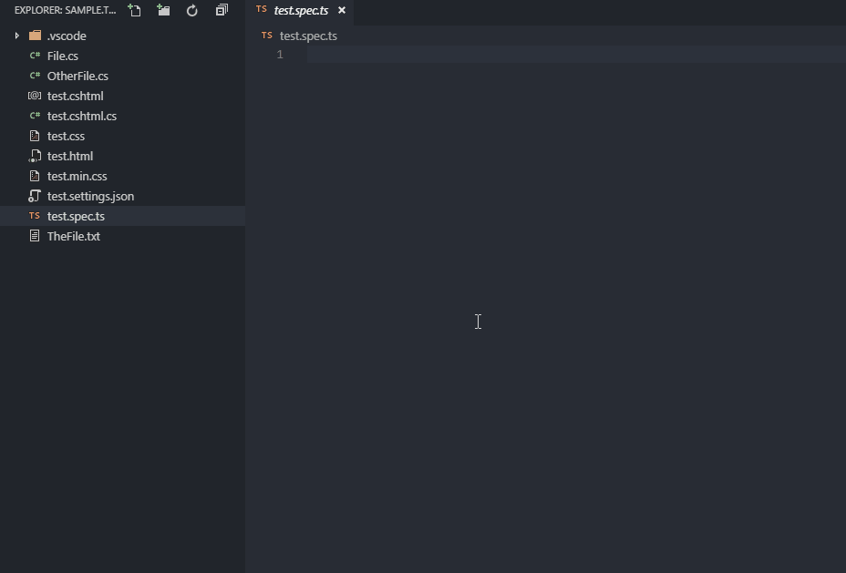
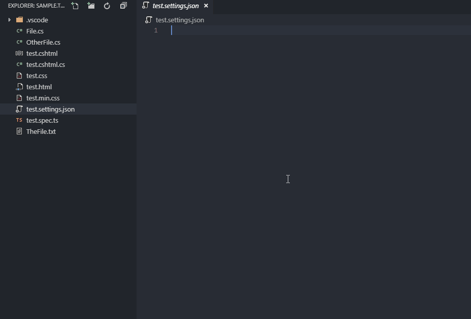
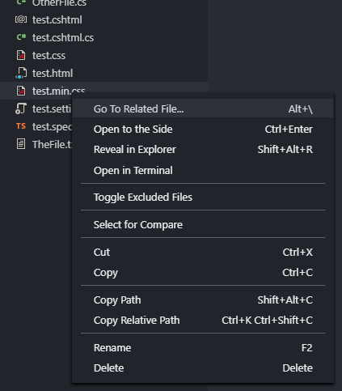

# File Switcher

Cycle trough related files (sharing the same basename but with different extensions) using keybindings or navigate with handy quick pick menu. No configuration required.

## Features

### Go To Next/Previous Related File

#### Keybindings
- `Alt + [` - Go To Previous Related File
- `Alt + ]` - Go To Next Related File

### Go To Related File... (using quick pick menu)

#### Keybindings
- `Alt + '`

#### Explorer Context Menu

